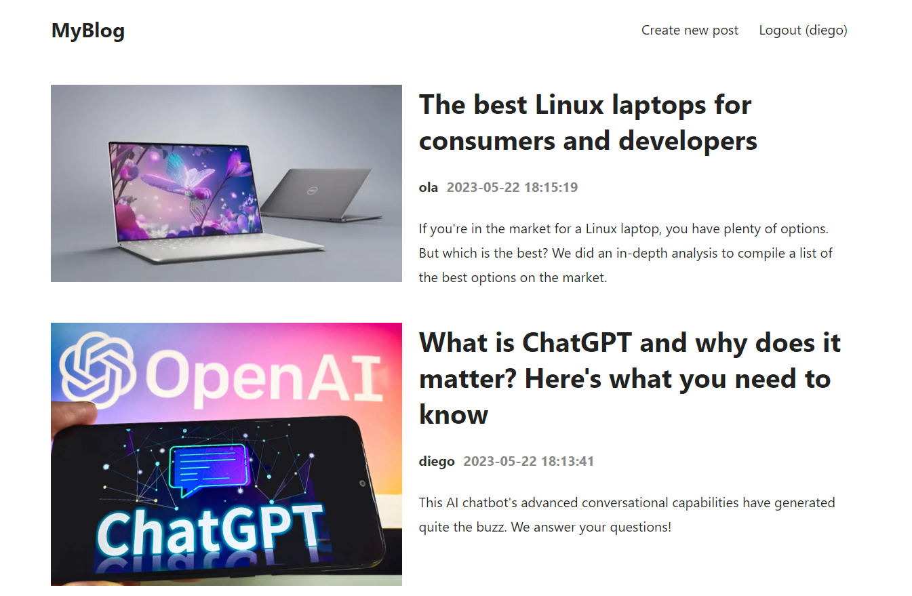
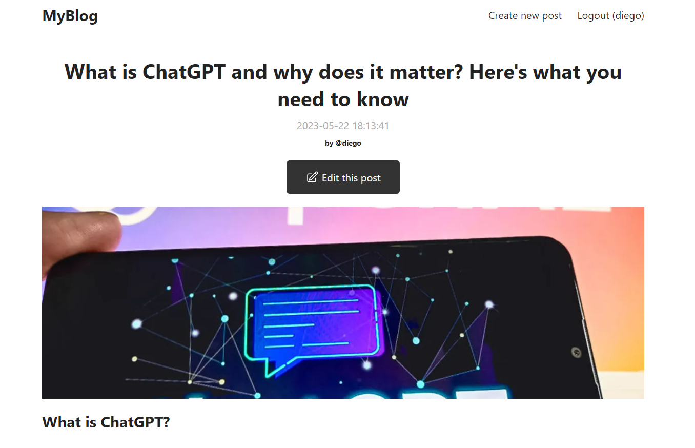

# Blog Full Stack MERN
This project is a full-stack application that implements a blog using the MERN stack. Users can register, write posts with the ability to add images, and only the author of a post can modify it.




## Technologies Used
- MongoDB
- Express
- React
- Node.js

## Features
- User registration: Users can create an account to access the blog.
- Post creation: Users can write new posts and include images.
- Post modification: Only the author of a post can edit or update it.
- Secure authentication: User passwords are securely hashed using bcrypt.
- File upload: Images can be uploaded and associated with blog posts.

## Installation
1. Clone the repository:
 ```git clone https://github.com/diegoddie/fullstack_MERN_blog.git```

2. Install the dependencies:
```yarn add`

3. Navigate to the react directory:
 ```cd client```

4. Install the dependencies again:
```yarn add```

5. Set up environment variables:
Create a .env file in the root directory.
Add the following variable to the .env file:
    - MONGODB_URI: The connection string for your MongoDB database.

6. Start the development server:
```yarn start```

7. Open your browser and visit http://localhost:3000 to see the application.

## Usage
- Register a new user account on the registration page.
- Log in with your credentials on the login page.
- Create new posts by clicking on the "New Post" button.
- Upload images by selecting them from your local file system.
- View and edit your own posts.
- Logout by clicking on the "Logout" button.